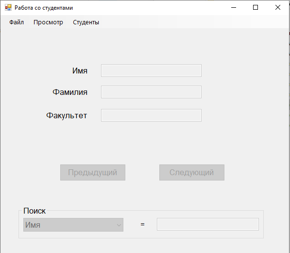

# students_management

Занимался разработкой приложения, которое позволяет открывать, редактировать и сохранять файл со списком студентов. Основные функциональности включали создание нового списка студентов, открытие существующего списка из файловых форматов xml или json, а также сохранение списка в указанных форматах. 

Для удобства просмотра списка, реализованы функции пролистывания списка студентов с использованием меню и кнопок на форме. Редактирование информации о текущем студенте и добавление нового студента также были включены в приложение. Предусмотрена возможность удаления текущего студента, а при удалении последнего студента в списке, соответствующие поля на форме автоматически становятся неактивными.

Реализована функция поиска студента по произвольному полю. Пользователь может выбрать поле для поиска из списка и ввести соответствующее значение. При выполнении команды "Предыдущий" или "Следующий", приложение переходит к предыдущему или следующему студенту, удовлетворяющему заданному условию поиска. 

Кроме того, в приложении была реализована работа с двумя типами студентов: бакалаврами и магистрами. При добавлении студента, пользователю задавался вопрос о его типе. В зависимости от типа студента, на форме отображались соответствующие поля, причем невидимые поля делались невидимыми. Если текущим студентом был бакалавр, на форме появлялась кнопка "Сделать магистром", при нажатии на которую бакалавр удалялся из списка, а на его месте появлялся новый студент-магистр.

Все функции были реализованы с учетом ясного разделения на "логику" и "интерфейс" при помощи классов.

